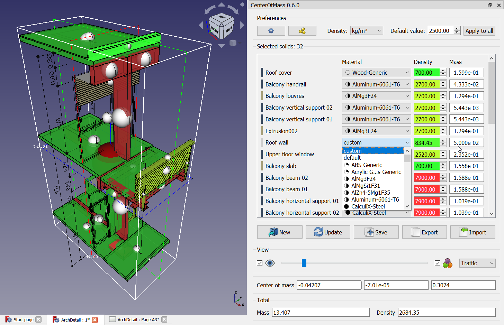

# CenterOfMass – A Macro for FreeCAD

> [!NOTE]
> You will find all information on the [official Wiki page](https://wiki.freecad.org/Macro_CenterOfMass).

> [!TIP]
> [Follow the discussion](https://forum.freecadweb.org/viewtopic.php?f=24&t=31883) on the forum or [go to official repository](https://github.com/FreeCAD/FreeCAD-macros) on Github.

## Description:
Gives the total mass and the location of the center of mass of selected objects. Different densities can be chosen for each object. 
> Compute and show the center of mass for multiple solids

## Usage:
1. Select one or more solids.
2. Launch the macro.
3. You'll have a window listing the solids. You can specify the density of your material in different unit systems or choose from predefined materials

## Available Options:
* Color the solids according to density.
* Display the location of the center of mass.
* Export and import masses, materials and densities (even if it's not a `.csv` file from the macro, but columns must be named accordingly).
* Save densities in the document (remove them again when setting material to `default`).
* You can change some preferences at Tools → Edit parameters → Preferences → Macros.

## Credits:
* 2018 – 2022: [schupin](https://github.com/chupins)
* 2022 – 2024: SyProLei project (Saarland University)
* 2025: [farahats9](https://github.com/farahats9)
* 2025 – 2026: s-quirin (former SyProLei project)
